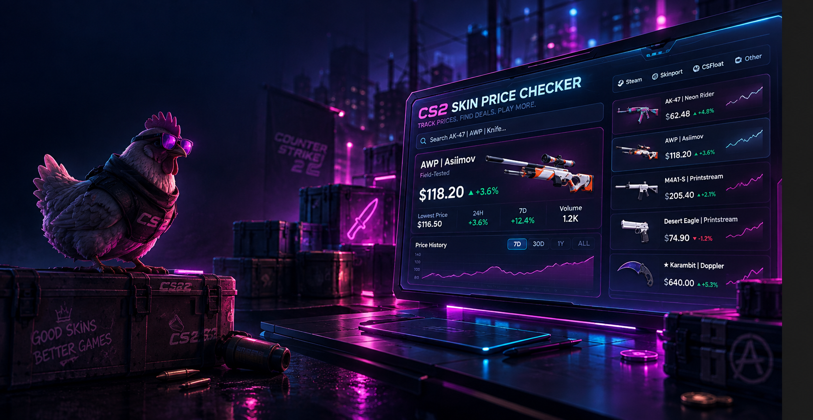
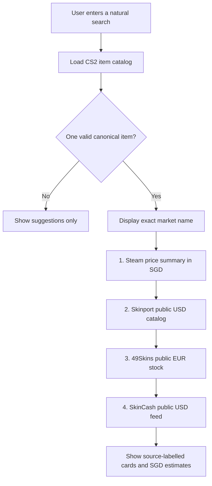

<p align="center">
  
</p>

<h1 align="center">CS2 Skin Price Checker</h1>

<p align="center">
  A neon-styled CS2 price tool that understands natural language, shows its lookup progress, and never invents a price.
</p>

<p align="center">
  <a href="https://shun-ren.github.io/cs_steambot/">
    
  </a>
</p>

<p align="center">
  
  
  
  
</p>

---

## Overview

CS2 Skin Price Checker is a local Flask website for checking live CS2 marketplace prices. Instead of scrolling through a fixed dropdown, users type what they mean:

```text
ak neon rider ft
ak stattrack neon rider ft
karambit fade fn
sport gloves vice ft
```

The app resolves the request to one exact market name before checking prices. It supports standard weapon skins, valid StatTrak variants, knives, gloves, wear shortcuts, and minor spelling mistakes.

<p align="center">
  
</p>

## Key features

- Natural-language search instead of static item dropdowns
- Supports weapons, valid StatTrak variants, knives, gloves, and wear conditions
- Recognises common shortcuts: `fn`, `mw`, `ft`, `ww`, and `bs`
- Shows a live loading bar and terminal-style progress feed
- Checks sources in order: Steam, Skinport, 49Skins, then SkinCash
- Shows each marketplace in its own card with its original price and currency
- Adds a live SGD estimate beside USD and EUR listings when FX data is available
- Shows selectable suggestions for unclear or invalid requests
- Never shows a made-up, stale, or mismatched price

## Lookup progress flow

When a user clicks **Check price**, the app makes the whole process visible instead of silently waiting.



### What the terminal log means

| Progress message | Meaning |
| --- | --- |
| `CS2 item catalog is ready` | The bot can now validate the typed name, wear, and variant. |
| `Matched exact market name` | A price lookup is safe because the input maps to one canonical CS2 item. |
| `Steam did not respond in time` | Steam was not used as a price; this is not treated as a zero price. |
| `No active listing` | The source is reachable, but that exact item has no current stock there. |
| `returned an active listing price` | The source returned a structured price for the exact matched item. |
| `No valid StatTrak version exists` | The standard item exists, but CS2 does not have that StatTrak variant. |

## Price validation rules

The app uses a simple safety-first tier system:

| Tier | Action | Result |
| --- | --- | --- |
| 1. Name validation | Compare the request against the public CS2 item catalog | No confident match means no price card |
| 2. Exact source check | Request structured marketplace data using the canonical name | Only exact active listings can show a price |
| 3. Currency handling | Keep the marketplace currency and calculate a separately labelled SGD estimate | Prices are never silently merged or relabelled |
| 4. Manual verification | Provide a direct marketplace link on every card | Users can inspect the live listing themselves |

This prevents an incorrect price tag from appearing when a provider is offline, has no stock, rate-limits the app, or returns an item that does not exactly match the search.

## Marketplace sources

| Marketplace | Data used | Native currency | Why it is useful |
| --- | --- | --- | --- |
| Steam Community Market | Public price summary | SGD | Direct Steam reference price when available |
| Skinport | Public items catalog | USD | Established marketplace catalog with current listings |
| 49Skins | Public active-stock snapshot | EUR | Live stock and cheapest active listing price |
| SkinCash | Public price feed | USD | Extra no-login fallback for items missing from other feeds |

Skinport, 49Skins, and SkinCash expose public structured data without a login. The CS2 item catalog used for matching is separate from pricing: it validates what the item is, but never supplies a price. See [Skinport docs](https://docs.skinport.com/items), [49Skins docs](https://49skins.com/public-price-api), [SkinCash docs](https://skincash.gg/en/developers), and the [ByMykel CS2 item catalog](https://github.com/ByMykel/CSGO-API).

## Search examples

| Type this | Resolves to |
| --- | --- |
| `ak neon rider ft` | `AK-47 | Neon Rider (Field-Tested)` |
| `ak stat-track neon rider mw` | `StatTrak(TM) AK-47 | Neon Rider (Minimal Wear)` |
| `karambit fade fn` | `Star Karambit | Fade (Factory New)` |
| `sport gloves vice ft` | `Star Sport Gloves | Vice (Field-Tested)` |
| `ak stat-track wild lotus mw` | No valid StatTrak variant; suggests standard Wild Lotus |

## Run locally

```powershell
cd "C:\Users\65976\Desktop\cs_steambot\cs_steambot"
.\.venv\Scripts\Activate.ps1
python -m pip install -r requirements.txt
python app.py
```

Open [http://127.0.0.1:5000](http://127.0.0.1:5000) in a browser.

To create the environment for the first time:

```powershell
python -m venv .venv
.\.venv\Scripts\Activate.ps1
python -m pip install -r requirements.txt
```

## Project structure

```text
app.py                 Flask routes and Server-Sent Events progress stream
pricing.py             Item matching, provider checks, FX estimates, safety rules
templates/index.html   Search form, loading state, terminal log, price cards
static/style.css       Neon blue / pink / purple visual design
static/market-hero.png Website banner artwork
assets/readme-hero.png README cover artwork
requirements.txt       Python dependencies
```

## Important notes

- This is a comparison tool, not a trading bot or financial recommendation.
- Marketplace availability, fees, listing prices, and exchange rates change constantly.
- An SGD figure beside a USD or EUR price is an estimate. The original marketplace price is always the source-of-truth value.
- Always open the linked marketplace and verify the final listing before buying.
